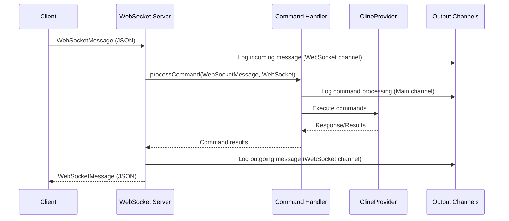

# System Patterns: Roo Code WebSocket Server

## Architecture Overview

### Component Structure

1. **WebSocket Server (`src/server/websocket-server.ts`)**

    - ✅ Core WebSocket server implementation
    - ✅ Message handling and validation
    - ✅ Client connection management
    - ✅ Enhanced logging via dedicated output channel
    - ✅ Client tracking with Set data structure
    - ✅ Clean connection cleanup

2. **Command Handler (`src/server/command-handler.ts`)**

    - ✅ Basic command handling structure
    - ✅ Integration with ClineProvider
    - ✅ Command validation and verification
    - ✅ Proper error handling and reporting

3. **Settings UI (`webview-ui/src/components/settings/SettingsView.tsx`)**

    - ✅ WebSocket enable/disable toggle
    - ✅ Port configuration input
    - ❌ Settings persistence (known issue, to be addressed later)

4. **State Management (`webview-ui/src/context/ExtensionStateContext.tsx`)**
    - ✅ WebSocket state interface
    - ✅ State setter functions
    - ❌ State persistence (known issue, to be addressed later)

### Message Flow Pattern

The message flow for WebSocket communication follows this pattern:



### Key Technical Decisions

1. **Output Channel Separation**

    - "Roo-Code WebSocket" channel for WebSocket server logs
    - "Roo-Code" channel for command handling
    - Clear separation of concerns for better debugging

2. **WebSocket Library: `ws`**

    - ✅ Successfully implemented and tested
    - ✅ Reliable client connections
    - ✅ Good TypeScript support
    - ✅ Enhanced error handling

3. **JSON Message Format for Streaming**

    The WebSocket server uses this simplified JSON format for streaming messages:

    ```json
    // For general chat messages:
    {
      "type": "message",
      "output": "The text of the chat message",
      "partial": true/false
    }

    // For Cline's reasoning/thoughts:
    {
      "type": "reasoning",
      "output": "The text of Cline's reasoning",
      "partial": true/false
    }

    // For status updates:
    {
      "type": "status",
      "statusType": "command_output", // Example types: "command_output", "api_req_started", "tool_result", "error"
      "text": "Optional status text",
      "partial": true/false // Optional for streamable status messages
    }
    ```

4. **Settings Management**
    - Default port: 7800
    - Enable/disable toggle in UI
    - State managed through ExtensionStateContext
    - Known issue: Settings not persisting (to be fixed)

### Design Patterns

1. **Singleton Pattern**

    - Single WebSocket server instance per VSCode window
    - Managed through extension context
    - Proper cleanup on deactivation

2. **Observer Pattern**

    - WebSocket clients tracked in Set data structure
    - Server broadcasts updates to all connected clients
    - Clean client removal on disconnection

3. **State Management Pattern**
    - React context for UI state
    - Extension state for server configuration
    - Known limitation: State persistence needs work

### Error Handling

1. **Connection Management**

    - ✅ Client tracking with Set data structure
    - ✅ Automatic client cleanup on errors
    - ✅ Clean server shutdown
    - ✅ Enhanced error logging

2. **Message Handling**

    - ✅ JSON validation
    - ✅ Error responses to clients
    - ✅ Detailed error logging
    - ✅ Separate channels for different log types

3. **UI Error Handling**
    - ✅ Basic input validation
    - ✅ Enhanced error feedback
    - ✅ Connection status indication

### Testing Strategy

1. **Integration Tests**

    - ✅ WebSocket server startup/shutdown
    - ✅ Client connection handling
    - ✅ Command execution tests
    - ✅ Error handling verification

2. **UI Testing**
    - ✅ Basic component rendering
    - ✅ Settings interaction tests
    - ✅ State management tests

### Security Considerations

1. **Input Validation**

    - ✅ JSON validation
    - ✅ Parameter validation
    - ✅ Error handling for invalid input

2. **Connection Management**
    - ✅ Local-only connections
    - ✅ Connection validation
    - ✅ Client tracking and cleanup
    - ⏳ Rate limiting (planned)

### Current Status

1. **Server Implementation**

    - ✅ WebSocket server operational
    - ✅ Command handling working
    - ✅ Client connections stable
    - ✅ Logging separation implemented

2. **UI Implementation**

    - ✅ Settings components added
    - ✅ State management structure in place
    - ❌ Settings persistence not working

3. **Known Issues**
    - Settings UI persistence not working
    - Message output format needs refinement
    - Minor display improvements needed

### Next Steps

1. **Primary Focus (Current)**

    - 🔄 Refine message output format
    - 🔄 Improve client message display
    - 🔄 Enhance error messages

2. **Future Improvements**
    - Fix settings persistence
    - Add connection status indicator
    - Enhance error handling and feedback
    - Implement rate limiting

### Notes

- Settings persistence is a known issue but not blocking
- Core WebSocket functionality working well
- Logging separation improves debugging
- Client tracking and cleanup working effectively
